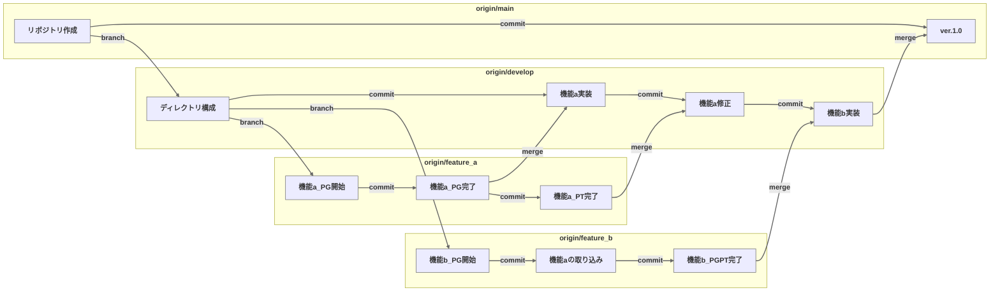
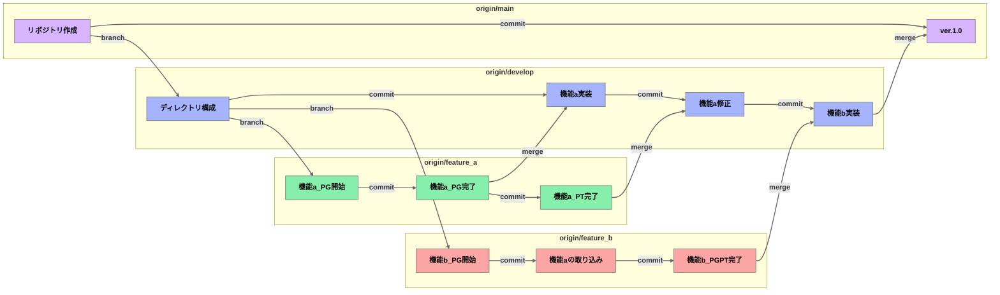

## リモートリポジトリ運用例

### 色無し

```mermaid
graph LR
    style リポジトリ作成 stroke:#666,font-weight:bold;
    style ver.1.0 stroke:#666,font-weight:bold;
    style ディレクトリ構成 stroke:#666,font-weight:bold;
    style 機能a実装 stroke:#666,font-weight:bold;
    style 機能a修正 stroke:#666,font-weight:bold;
    style 機能b実装 stroke:#666,font-weight:bold;
    style 機能a_PG開始 stroke:#666,font-weight:bold;
    style 機能a_PG完了 stroke:#666,font-weight:bold;
    style 機能a_PT完了 stroke:#666,font-weight:bold;
    style 機能b_PG開始 stroke:#666,font-weight:bold;
    style 機能aの取り込み stroke:#666,font-weight:bold;
    style 機能b_PGPT完了 stroke:#666,font-weight:bold;

    subgraph origin/main[<b>origin/main</b>]
        リポジトリ作成 -->|<b>commit</b>| ver.1.0
    end

    subgraph origin/develop[<b>origin/develop</b>]
        リポジトリ作成 -->|<b>branch</b>| ディレクトリ構成
                    -->|<b>commit</b>| 機能a実装
                    -->|<b>commit</b>| 機能a修正
                    -->|<b>commit</b>| 機能b実装
                    -->|<b>merge</b>| ver.1.0
    end

    subgraph origin/feature_a[<b>origin/feature_a</b>]
        ディレクトリ構成 -->|<b>branch</b>| 機能a_PG開始
                     -->|<b>commit</b>| 機能a_PG完了
                     -->|<b>merge</b>| 機能a実装

        機能a_PG完了 -->|<b>commit</b>| 機能a_PT完了
        機能a_PT完了 -->|<b>merge</b>| 機能a修正
    end

    subgraph origin/feature_b[<b>origin/feature_b</b>]
        ディレクトリ構成 -->|<b>branch</b>| 機能b_PG開始
                     -->|<b>commit</b>| 機能aの取り込み
                     -->|<b>commit</b>| 機能b_PGPT完了
                     -->|<b>merge</b>| 機能b実装
    end

    linkStyle 0,1,2,3,4,5,6,7,8,9,10,11,12,13,14 stroke:#666,stroke-width:2px;
```

### 色有り

```mermaid
graph LR

    style リポジトリ作成 fill:#d8b4fe,stroke:#666,font-weight:bold,color:#000000;
    style ver.1.0 fill:#d8b4fe,stroke:#666,font-weight:bold,color:#000000;
    style ディレクトリ構成 fill:#a5b4fc,stroke:#666,font-weight:bold,color:#000000;
    style 機能a実装 fill:#a5b4fc,stroke:#666,font-weight:bold,color:#000000;
    style 機能a修正 fill:#a5b4fc,stroke:#666,font-weight:bold,color:#000000;
    style 機能b実装 fill:#a5b4fc,stroke:#666,font-weight:bold,color:#000000;
    style 機能a_PG開始 fill:#86efac,stroke:#666,font-weight:bold,color:#000000;
    style 機能a_PG完了 fill:#86efac,stroke:#666,font-weight:bold,color:#000000;
    style 機能a_PT完了 fill:#86efac,stroke:#666,font-weight:bold,color:#000000;
    style 機能b_PG開始 fill:#fca5a5,stroke:#666,font-weight:bold,color:#000000;
    style 機能aの取り込み fill:#fca5a5,stroke:#666,font-weight:bold,color:#000000;
    style 機能b_PGPT完了 fill:#fca5a5,stroke:#666,font-weight:bold,color:#000000;


    subgraph origin/main[<b>origin/main</b>]
        リポジトリ作成 -->|<b>commit</b>| ver.1.0
    end

    subgraph origin/develop[<b>origin/develop</b>]
        リポジトリ作成 -->|<b>branch</b>| ディレクトリ構成
                    -->|<b>commit</b>| 機能a実装
                    -->|<b>commit</b>| 機能a修正
                    -->|<b>commit</b>| 機能b実装
                    -->|<b>merge</b>| ver.1.0
    end

    subgraph origin/feature_a[<b>origin/feature_a</b>]
        ディレクトリ構成 -->|<b>branch</b>| 機能a_PG開始
                     -->|<b>commit</b>| 機能a_PG完了
                     -->|<b>merge</b>| 機能a実装

        機能a_PG完了 -->|<b>commit</b>| 機能a_PT完了
        機能a_PT完了 -->|<b>merge</b>| 機能a修正
    end

    subgraph origin/feature_b[<b>origin/feature_b</b>]
        ディレクトリ構成 -->|<b>branch</b>| 機能b_PG開始
                     -->|<b>commit</b>| 機能aの取り込み
                     -->|<b>commit</b>| 機能b_PGPT完了
                     -->|<b>merge</b>| 機能b実装
    end

    linkStyle default stroke:#666,stroke-width:2px;
```
